```{r setup} 
#| include: false 
library(reticulate) 
```

```{r}
#| label: pakker-setup
#| echo: true
#| eval: false
#| message: false
#| warning: false

options(OutDec = ",")

# Pakker
pacman::p_load(
  tidyverse, tidymodels, themis, table1, ggpubr, broom, ggfortify,
  GGally, PerformanceAnalytics, car, caret, skimr, discrim, glmnet,
  kknn, naivebayes, kernlab, xgboost, gridExtra, rpart, future,
  ranger, rmarkdown, rvest, httr, jsonlite, rlist, rjson,
  Rcrawler, hrbrthemes, knitr, hms, leaps, readxl, gbm,
  randomForest, stringr, rsample, haven, lubridate, vip, dplyr, janitor)
```

\thispagestyle{empty}
## Læsevejledning {.unnumbered .unlisted}
Dette projekt er udarbejdet i forbindelse med 2. semesterprøven på Dataanalyse uddannelsen hos Erhvervsakademi Dania. Projektet er lavet af gruppe 2, bestående af Dennis Bork Kjeldsen, Martin Munk Laigaard, Rasmus Bech Poulsen og Sebastian Krog Husted.
I projektet vil der fremover blive brugt forkortelser, sådan at Jyllands-Posten, omtales som JP, Machine Learning omtales som ML, og Deep Learning omtales som DL.

**Link til GitHub:** https://github.com/MartinLaigaard19/JP-semesterprojekt 

**Link til PowerBI:** https://app.powerbi.com/links/arZP2Ljuzr?ctid=c9e7bb4d-4734-49ba-95ee-3cd2e20b90f2&pbi_source=linkShare
\newpage


\pagenumbering{gobble} 
\tableofcontents 
\newpage 
\listoffigures 
\newpage 
\pagenumbering{arabic} 
\setcounter{page}{1}


# Problemstilling {#sec-problemstilling}
I et digitalt medielandskab præget af intens konkurrence og abonnementstræthed er evnen til at fastholde og konvertere abonnenter afgørende for den kommercielle stabilitet hos Jyllands-Posten (JP). JP opererer i et marked, hvor print falder, og væksten skal findes digitalt en udvikling, der afspejler en bredere strukturel forandring i mediebranchen. Med over 300.000 ugentlige læsere og mere end 1,1 million månedlige besøgende på jp.dk er det digitale potentiale betydeligt, men det rejser samtidig en central udfordring for JP's kommercielle afdeling, herunder specialist Morten og analysechef Roland: en høj churn-rate, der særligt opstår på kampagnebaserede introduktionstilbud, og en manglende forståelse af, hvornår og hvorfor abonnenter forlader platformen.

Jyllands-Postens analyseafdeling arbejder datadrevet med at understøtte beslutninger på tværs af organisationen, herunder abonnement, announce og redaktion. JPs vigtigste datakilde er Snowplow, som indsamler førstepartsdata om brugeradfærd, læsemønstre, sidevisninger og engagement. Organisationen har også andre datakilder som blandt andet Gemius der indsamler data om danskernes online adfærd, som bopæl, boligtype, alder, indkomst og interesser, samt bruger de Kantar Gallup som indsamler officielle læsertal, kortlægning af forbrug, holdninger, livsstil, denne kilder benytter de primært til demografisk segmentering.
For at imødekomme denne udfordring er der et behov for at udvikle en datadrevet tilgang, der på baggrund af abonnenternes adfærd og demografiske profil kan forudsige, hvilke kunder der forventes at churne ved enten kampagneperiodens afslutning eller inden for en kortere efterfølgende periode. En ML-model, der identificerer disse mønstre i tide, vil kunne fungere som et proaktivt beslutningsværktøj for JP’s kommercielle afdeling, og gøre det muligt at målrette fastholdelsesstrategier mod de mest udsatte segmenter, inden de opsiger.
Effektiv formidling af ML resultater er afgørende for, at JP’s kommercielle afdeling kan omsætte data til konkrete handlinger. Datavisualiseringen i dette projekt fungerer som broen mellem det, der gør det muligt for beslutningstagere som Roland og Malene, at afkode mønstre i de tre datasæt: Subscription, Behavior, Cancellation. Ved at transformere rå adfærdsdata til et visuelt layout bliver det muligt at identificere præcis, hvor engagement falder og hvad der udløser churn efter kampagneperiodens udløb.

Som en central del af løsningen udvikles en visuel repræsentation i PowerBI, der fungerer som et strategisk dashboard. Her kan brugeren filtrere i kundesegmenter baseret på parametre som køn, alder, scrolldybde for at isolere specifikke risikogrupper i realtid. Appen integrerer direkte med projektets neurale netværk, hvilket gør det muligt at visualisere de avancerede, ikke lineære sammenhænge i kunderejsen, som simplere modeller kan overse. Da neurale netværk kan fremstå som “Black-Box”-modeller, anvendes visualiseringer af weights og feature importance til at skabe gennemsigtighed. Dette giver ledelsen indsigt i, hvordan faktorer som antallet af aktive dage eller devicetype vægtes i modellens forudsigelse af sandsynligheden for genkøb. 
I forbindelse med udviklingen af en Machine Learning-model til at forudsige churn blandt kampagneabonnenter hos JP, opstår der en række juridiske og etiske problemstillinger. Disse relaterer sig særligt til, at JP behandler personoplysninger om abonnenter med henblik på profilering og forudsigelse af fremtidig adfærd. Projektet anvender både adfærdsdata (abonnenters læsemønstre, sidevisninger, scrolldybde, og device-type) samt demografiske oplysninger (herunder køn og fødselsdato), hvilket gør det nødvendigt for JP at forholde sig til GDPR, markedsføringslovgivning og generelle dataetiske principper.


\newpage
## Problemformulering {#sec-pf}
Hvordan kan Jyllands-Posten anvende Machine Learning til at identificere adfærdsmønstre og kundesegmenter med henblik på at forudsige churn hos kampagneabonnenter, både ved kampagneperiodens afslutning og i den efterfølgende abonnementsperiode. Ligeledes hvordan kan disse indsigter visualiseres og omsættes til en målrettet fastholdelsesstrategi, når der samtidig tages højde for de juridiske og etiske overvejelser ved brugen af abonnentdata.

## Undersøgelsesspørgsmål:
1. Hvilke klassifikationsmodeller er mest velegnede til at forudsige churn ved kampagneperiodens afslutning, og hvordan kan modellen identificere fortsættere med forhøjet risiko for fremtidig opsigelse?

2. Hvilke adfærdsmæssige og demografiske faktorer er de stærkeste prædiktorer for churn, og hvilke kundesegmenter kan identificeres på baggrund af abonnentprofiler og adfærdsdata?

3. Hvordan kan analysens resultater formidles visuelt, så de understøtter konkrete beslutninger i JP's kommercielle afdeling?

4. Hvilke juridiske og etiske problemstillinger opstår ved JP's behandling af abonnentdata, og hvordan kan de håndteres ansvarligt?

5. Hvilke problemstillinger opstår i forhold til gennemsigtighed og "bias" i modellerne, når JP behandler personfølsomme data til profilering?


\newpage
# GDPR og behandling af personoplysninger:

## Behandlingsgrundlag:
JP skal for hvert behandlingsformål kunne identificere et gyldigt behandlingsgrundlag jævnfør GDPR artikel 6. Til selve abonnentadministration er art. 6 (1b), opfyldelse af kontrakt, det naturlige grundlag. For markedsføringsforing og ML-baseret profilering er udgangspunktet derimod samtykke art 6. (1a), hvilket afspejles direkte i datasættet via permission_given_order og permission_given_today. Det er afgørende at JP kan dokumentere, at samtykke er givet frivilligt, specifikt og informeret, samt nemt at trække tilbage. Ændringer mellem de to permission-variabler indikerer, at en del abonnenter aktivt har fravalgt videre kontrakt, dette skal JP derfor respektere med det samme.[@gdpr_artikel6]

## Dataminimering og Opbevaringsbegrænsning:
GDPR’s princip om dataminimering kræver, at der kun behandles oplysninger, der er nødvendige for det specifikke formål. Her skal JP overveje, om detaljerede adfærdsata (scrolldybde, præcis trafikkilde, devicetype) over 30 dage er nødvendige i forhold til formålet med churn prædiktioner. Desuden kræver opbevaringsbegræningsprincippet, at JP fastsætter konkrete sletningsfrister, oplysninger om opsagte abonnementer bør ikke opbevares i årevis uden dokumenteret saglig begrundelse. Det kunne opretholdes ved opdatering hos abonnenter via email om sletning af data snart.[@gdpr_artikel5]

## De registreredes rettigheder:
Abonnenterne har en række rettigheder, som JP er forpligtet til at tage højde for i praksis.

- Ret til indsigt (art. 15): En abonnent kan til enhver tid kræve at se, hvilke oplysninger JP behandler om dem
- Ret til sletning (art. 17): Efter opsigelse af abonnement har kunden ret til at få sine data slettet, medmindre der er lovhjemlet grund til fortsat behandling.
- Ret til dataportabilitet (art. 20): Kunden kan kræve at få since data udleveret i læsbart format
- Indsigelsesret (art. 21): Kunden kan gøre indsigelse mod behandling til direkte markedsføring og profilering, og JP skal efterkomme dette uden unødig forsinkelse.
[@gdpr_artikel22] 

\newpage
## Oplysningspligt:
JP er forpligtet til på tidspunktet for dataindsamling at oplyse abonnenterne om formålene med behandlingen, behandlingsgrundlaget, opbevaringsperioden og retten til at klage til Datatilsynet. Da projektet anvender abonnentdata til ML-baseret profilering og churn prædiktioner, skal dette fremgå eksplicit af JP’s privatlivspolitik. En generisk formulering om “forbedring af brugeroplevelsen” vil ikke være nok begrundelse. [@gdpr__artikel13] 

## Markedsføringsloven:
Markedsføringsloven § 10 regulerer elektronisk direkte markedsføring og kræver som udgangspunkt forudgående samtykke til udsendelse af markedsførings henvendelser via e-mail og SMS. For eksisterende kunder gælder den såkaldte “soft opt-in” undtagelse: JP må markedsføre lignende produkter over for kunder, der allerede har tegnet et abonnement, forudsat at kunden tydeligt og gratis kan frabede sig fremtidige henvendelser.

Datasættet viser, at JP sporer nyhedsbrevsadfærd (newsletter_before_order, newsletter_after_order) og e-mail som trafikkilde. Dette indikerer, at e-mailmarkedsføring er et aktivt værktøj som JP bruger. JP bør sikre, at kunder der har ændret permission status fra aktiv til inaktiv fjernes fra markedsføringslister med det samme, og at afmeldingslinket i alle henvendelser fungerer korrekt. Henholdsvis har vi i vores datasæt lavet begge variabler om til newsletter_growth. [@databeskyttelsesloven]

## Cookie-bekendtgørelsen:
Adfærdsdata som page_url_clean, scroll_depth, device_type og os_family indsamles via cookies og trackers når abonnenterne tilgår hjemmesiden. I JP’s tilfælde bruges Snowplow primært til indsamling. Cookie bekendtgørelsen kræver at JP indhenter et aktivt, informeret samtykke, inden de ikke-nødvendige cookies sættes. Analyse og markedsføring cookies er teknisk set ikke nødvendigt og kræver derfor samtykke.[@cookiebekendtgrelsen] 

## Dataansvarlig & Databehandlere:
JP er dataansvarlig for de brugte datasæt. Benytter JP eksterne leveandører til cloud-hosting, dataanalyse, CRM eller lignende, er disse databehandlere. Der skal foreligge en databehandleraftale for hver leverandør. Aftalen skal præcist fortælle om formålet, de tekniske og organisatoriske sikkerhedsforanstaltninger samt regler for sletning ved aftalens ophør.[@gdpr__artikel28]

JP anvender Snowplow og Gemius som datakilder. Gemius indsamler demografiske data om danskernes online adfærd. Hvis disse eller andre leverandører opbevarer data hos amerikanske cloud-udbydere, såsom Microsoft Azure, Google Cloud, udgør det en tredjelandsoverførsel. [@dataprivacyframeworkprogram]

Datatilsynet fører tilsyn med JP’s overholdelse af GDPR og kan udstede bøder på op til 4% af den globale omsætning. JP skal desuden have en procedure for anmeldelse af sikkerhedsbrud: Databrud, der udgør en risiko for de registrerede, skal anmeldes til Datatilsynet inden 72 timer[@gdpr_artikel33] og i alvorlige tilfælde også til de berørte abonnenter.[@gdpr_artikel34]

## AI & Machine Learning:
Et vigtigt juridisk punkt i dette projekt er brugen af ML til at lave prædiktioner af churn og opbygge kundeprofiler. GDPR art. 22 regulerer automatiserede afgørelser og profilering af fysiske personer. Fuldt automatiserede afgørelser med retlig eller tilsvarende virkning for den registrerede er som udgangspunkt forbudt, medmindre der er givet samtykke, lavet kontraktuel samarbejde eller lovhjemmel. [@gdpr_artikel22]

Selvom JP’s churn-modeller sandsynligvis bruges som beslutningsstøtte frem for fuldt automatiserede afgørelser, er der tale om profilering, der bør oplyses om. Brugen af neurale netværk danner spørgsmål om gennemsigtighed: Disse modeller fremstår som “Black Boxes”, og abonnenterne har reelt ingen mulighed for at forstå, hvorfor de er udpeget som potentielle churnere. Projektets visualisering af feature importance er et positivt skridt mod forklaring af dataen til den almindelige person. Det bør dog suppleres med klar kommunikation. [@datatilsynet_markedsføring]

JP bør være opmærksom på risikoen for bias i modellerne. Hvis træningsdataen afspejler historiske skævheder, som bestemte aldersgrupper eller køn som overrepræsentere i opsigelsedata, kan modellen reproducere disse skævheder og uretmæssigt målrette fastholdelsesstrategier mod eller væk fra bestemte segmenter. Dette udgør ikke kun et etisk problem, men kan også gå imod ligebehandlingsprincipper.[@gdpr_artikel5] 

## Dataetik:
Det juridiske system sætter minimumsgrænser for, hvad JP må gøre, men dataetik handler om spørgsmålet, hvad bør JP gøre?[@dataetiskråd]

JP’s churn-model er et godt eksempel på dataetik. Behandlingen er sandsynligvis lovlig, men det ændrer ikke ved, at abonnenter, der har tegnet et to-måneders prøveabonnement, ikke forventer at deres scrolldybde, trafikkilder, læseadfærd, device typer, løbende analyseres med henblik på at forudsige, om de vil opsige. Der er med andre ord en ubalance mellem, hvad JP ved om sine abonnenter, og hvad abonnenterne ved om JP’s brug af data. Det er netop dette, som er kernen i det centrale dataetiske problem.[@jppolitikenshus_dataretningslinjer] 

Denne ubalance bliver særligt problematisk, når ML-modellens output bruges til at målrette fastholdelsesstrategier mod specifikke segmenter. Hvis disse abonnenter efterfølgende udsættes for aggressive fastholdelsesstrategier baseret på profilering, de ikke er bevidste om, risikerer JP at træffe beslutninger på et grundlag, som abonnenterne hverken har indsigt i eller mulighed for at modsætte sig. Det er her at lov og etik skilles ad, behandlingen af data kan være i overensstemmelse med GDPR, men udfordrer principperne om dataetik.[@dataetiskråd_principper]

I en tid med stigende forbrugerbevidsthed om dataprivacy kan JP aktivt vælge at fremhæve ansvarlig dataanvendelse som en del af deres brand identitet. En offentliggjort og let tilgængelig dataetisk politik, der beskriver hvilke data JP indsamler, til hvilke formål og med hvilke begrænsninger, kan styrke abonnenternes tillid og differentiere JP positivt fra konkurrenterne.

\newpage
# Dataforberedelse:
Dette afsnit er baseret på den fulde kode af dataforberedelse, som kan findes i [Bilag 1: Kode til Dataforberedelse](#sec-bilag1).

## Dataforståelse:
For at styrke sin position på markedet for digitale nyhedsabonnementer lancerede JP i begyndelsen af foråret 2025 kampagnen JPs digital, der tilbød et to-måneders abonnement til 49 kroner. Kampagnen havde til formål at tiltrække og fastholde både nye og eksisterende kunder, samt at indsamle brugerdata, som danner grundlaget for denne churnanalyse.

## Indsamling af Data:
Data til analysen er primært indsamlet via SnowPlow Analytics, som er et værktøj JP anvender til at indsamle eventdata såsom sidevisninger, scroll dybde og engagement m.m. i løbet af kampagnen. Dette har resulteret i at der stilles tre forskellige datasæt til rådighed – subscriptions, behavior og cancellation, som samlet set udgør projekts analytiske grundlag. På tværs af alle tre datasæt er kunderne pseudonymiseret gennem et autogenereret pseudo_id, så de studerende kan arbejde med kundernes abonnement data uden at kende deres identitet. Dette pseudo_id fungerer som primary key til at forbinde de tre datasæt. Nedenstående er en gennemgang af de tre datasæt.

## Beskrivelse af Data:
Subscription datasættet består samlet set af 1.281 abonnenter og 17 variable, som indeholder demografiske og abonnementsmæssige oplysninger om den enkelte bruger, f.eks. køn, birthdate og account_active_days, usr_created og order_date.  Der er også nogle mere specifikke variable omkring brugeren f.eks. previous_subscriptions, previous_campaigns og previous_trials, som kan give et indblik i hvor engageret en bruger har været i tidligere kampagner. First_campaign_day og last_campaign_day fortæller hvornår brugeren tilmeldte sig kampagnen, samt udløbsdatoen. Derudover findes også subscription_cancel_date som fortæller om og hvornår kunden har opsagt kampagnen. 

Til sidst permission_given_order og permission_given_today, som fortæller hvorvidt brugeren har givet tilladelse til at modtage nyhedsbreve ved tilmelding og om denne tilmelding stadig er gældende ved kampagnens udløb, samt newsletters_before_order og newsletters_after_order, som giver et billede af om der har været positiv eller negativ vækst i mængden af nyhedsbreve.
Behavior datasættet indeholder 265.456 observationer og 10 variable, som indeholder oplysninger om brugerens adfærd på JP.dk. Hver række registrerer den enkelte brugers adfærd, herunder dvce_type og os_family, som angiver hvilken enhed og styresystem brugeren anvender. Brugerens sidevisning vises i page_url_clean, hvor dato registreres som dt og dato klokkeslæt som collector_tstamp. Derudover registreres brugerens scroll_depth på hver enkelt artikel, som kan bruges til at vurdere brugerens engagement samt page_restricted, som angiver hvorvidt artiklen var låst for brugere som ikke har et abonnement. Til sidst refr_medium, som angiver kundens sti til JP.dk, f.eks. gennem søgemaskine eller sociale medier, som giver et indblik i kundens medievaner og adfærdsmønstre. Hver enkelt sidevisning tildeles et unikt ID i webpage_id.
Cancellation datasættet indeholder 1.092 observationer og 4 variable. Datasættet giver et indblik i hvilke kunder der har opsagt deres abonnement under expiration_date, samt type og reason hvor kunden har angivet en begrundelse for opsigelsen.
Fælles for de tre datasæt er, at de indeholder uhensigtsmæssige datatyper. Eksempelvis er datovariabler som expiration_date, first_campaign_day og birthdate lagret som characters, og skal derfor konverteres til et dato format. permission_given_order og permission_given_today er angivet som characters ”true” og ”false”, skal konverteres til booleske værdier, for at kunne indgå i en senere modellering. Kolonnen koen er ligeledes angivet som characters ”Mand” og ”Kvinde”, skal konverteres til faktors.

## Undersøgelse af Data:
For at få et overblik over datasættet undersøges først fordelingen på to af de mest centrale variable, køn og alder, som viser en skæv kønsfordeling da mænd udgør  69,1% af kampagnen, hvilket indikerer at der er 2,4 gange så mange mænd som kvinder tilmeldt kampagnen. Det er værd at nævne at 2,1% af brugernes ikke har angivet noget køn.

{#fig-jp-køn width="80%"}

Mænd er i gennemsnit lidt ældre end kvinder med 61,3 år mod kvindernes 57,8, en forskel på 3,5 år. For at undgå eventuelle outliers udregnes medianen, hvilket minimerer aldersforskellen til 2,1 år. Hvis man kigger på tidligere abonnement data, ligger mænd også højere på alle tre variable, hvilket godt kunne indikere, at mænd i højere grad er målgruppen for produktet.

\newpage
## Data Kvalitet:
Ved at anvende colSums(is.na() på de forskellige datasæt får vi et overblik over missing values, og konkluderede at datakvaliteten var god, da der ikke var nogen missing values.
Kolonnen køn indeholder to køn, 885 mænd og 369 kvinder. De resterende 27 er angivet som en blank værdi, og optræder derfor ikke som missing values.
Enkelte brugere har sandsynligvis oprettet deres bruger med en forkert fødselsdagsdato, da der er flere observationer med en fødselsdagsdato senere end 01-01-2024, hvilket kan komme til at påvirke gennemsnitsalderen. Vi vælger alligevel at beholde disse observationer, da det kan være et signal for lavt engagement som en model potentielt kan identificere som en churn indikator.
Ved at anvende colSums(duplicated () på subscription og cancellation ser vi der er henholdsvis 2 og 40 dubletter i de to datasæt. Dette indikerer at nogle kunder fremgår mere end en gang, særligt under cancellation er visse abonnementer opsagt mere end en gang, hvilket resulterer i en many-to-many relation når de to datasæt joines.   

## Data Forberedelse:
I forbindelse med at joine cancellation og subscription opstår der en many-to-many relation, da pseudo_id ikke er unik, hvilket medfører at nogle observationer aggregeres dobbelt, som derved skaber misvisende resultater. Dette øger bias i modellen og håndteres derfor ved at gruppere begge datasæt og sortere efter seneste opsigelsesdato, som anvendes fremadrettet. Denne metode er valgt for at sikre at hver observation kun optræder en gang, hvilket gør at adfærdsdata senere aggregeres korrekt.

Datasættet behavior indeholder flere observationer pr. bruger og aggregeres derfor på pseudo_id, hvorved en række adfærdsvariable oprettes, herunder avg_scroll, page_views, days_with_activity, restricted_read, dominant_category. Disse variable beskriver brugerens aktivitetsniveau og adfærdsmønstre, herunder hvor mange artikler brugeren læser, hvor stor en andel af indholdet som er låst for almindelige brugere, brugerens foretrukne kategori og et gennemsnit af hvor meget brugeren læser af hver artikel. Disse variable kan være stærke signaler i en churn analyse, da brugere med et lavt aktivitetsniveau og scrolldybde, sandsynligvis ikke udnytter kampagnen, hvilket kan være et signal om at brugeren churner.
Til at oprette variablen age_at_order konverteres relevante variable til datoformat. Brugerens alder forventes at være et stærkt churn signal, da interesse niveauet kan variere efter aldersgruppe. Derudover kan brugerens køn afspejle om der er forskelle i adfærd, og dermed sandsynligheden for churn. Nogle brugere kan have en tendens til at udnytte kampagnetilbud, og derfor oprettes variablen is_returning, som identificerer om brugeren tidligere har haft et abonnement ved JP, hvilket kan indikere at brugeren har en mere løs relation til JP.

Ved at inkludere adfærdsspecifikke variable såsom pages_on_restricted kan det identificeres, i hvor høj grad brugeren læser det indhold som er specifikt henvendt til betalende brugere, hvilket kan være et signal om at brugere engagerer sig og udnytter kampagnen.

Hvis brugeren har tilmeldt sig nyhedsbreve under kampagnen, kan det tyde på at der har været en stigning i interessen niveauet, og derfor inkluderes variablen newsletter_growth, for at belyse om brugeren har oplevet vækst i antallet af nyhedsbreve. Variablerne permission_upgraded og permission_withdrawn inkluderes, med henblik på at måle om der har været ændringer i brugerens holdning til nyhedsbreve. En udvikling kan indikere at der har været en stigning eller et fald i interesseniveauet, hvilket kan signalere churn.
Analysens målvariabel oprettes som en numerisk variabel (0/1) med udgangspunkt i expiration_date. Brugere med en manglende expiration_date klassificeres som 0, hvilket indikerer at brugeren fortsat har et aktivt abonnement, mens brugere med en expiration_date klassificeres som 1, hvilket indikerer at brugeren ikke længere er aktiv.

## Data Leakage:
I forbindelse med feature selection tages en række aktive valg for at undgå data leakage, hvilket indebærer at fjerne information som modellen ikke bør have adgang til på tegningstidspunktet. Variablerne fra cancellation datasættet expiration_date, subscription_cancel_date, type og reason fjernes, da de alle er et direkte churn signal omkring kundens opsigelse. Ved at inkludere disse variable, vil modellen finde et falsk mønster i træningsdata, hvilket resulterer i god performance på testdata, mens modellen vil at svært ved at fange i churn i virkeligheden.
 

\newpage
# Modellering

## Recipe:
Før modelleringen har vi defineret en recipe på tværs af alle 9 modeller for at sikre sammenlignelige og reproducerbare resultater. step_novel og step_dummy håndterer kategoriske variabler ved at konvertere dem til numeriske variabler, mens step_zv fjerner variabler med nul-varians. 
step_normalize standardiserer numeriske variabler, hvilket er vigtigt for de regulariserede modeller som Ridge og Lasso. Da modellerne er følsomme over for skalering, uden normalisering, vil variabler med store absolutte værdier dominere straf funktionen, hvilket kan føre til misvisende koefficient estimater.
step_corr med en threshold på 0.75 reducerer multikollinearitet ved at fjerne én af to variabler, der korrelerer stærkere end thresholdet. Vi afprøvede 0.80 som alternativ, men 0.75 gav bedre resultater på ROC AUC under bootstrapping. En mulig forklaring er, at 0.75 fjerner variabler, der i høj grad måler det samme, og dermed reducerer variance i estimaterne. Det er dog vigtigt at understrege, at valget er taget på empirisk grundlag frem for teoretisk, en sensitivity analyse med andre thresholds ville styrke konklusionen yderligere.
Det vigtigste trin for vores recipe er step_downsample, som balancerer fordelingen af churnere og ikke-churnere i træningsdata. Uden denne funktion oplevede vi at modeller lærte at favorisere majoritetsklassen “ikke-churnere”, fordi det minimerer den samlede mængde af fejl, men på bekostning af evnen til at identificere faktiske churnere. 
Downsampling reducerer majoritetsklassen tilfældigt til at matche minoritetsklassens størrelse og anvendes udelukkende på træningsdata, testdata forbliver ubalanceret og afspejler dermed den reelle fordeling.
Vi afprøvede ligeledes Upsampling via SMOTE og ingen resampling som alternativer. Upsampling skaber nye observationer i minoritetsklassen baseret på de eksisterende data, hvilket i teorien bevarer mere information end downsampling. I vores tilfælde gav det dog dårligere generaliseringsevne, sandsynligvis fordi de genererede observationer introducerede støj i et relativt lille datasæt. Uden resampling var sensitivity markant lavere, som forventet, da modellen i højere grad tilpasser sig majoritetsklassen. Downsampling fremstår derfor som det bedst understøttede valg i vores projekt. Det betyder dog at information går tabt ved at observationer fra majoritetsklassen fjernes. [Bilag 2: Rangering af recipe](#sec-bilag2)

\newpage
### Modellering kode
```{r}
#| label: recipe
#| echo: true
#| eval: false

# *******************************************************************************************
#                                        Modellering                                     ----
# *******************************************************************************************
# Bruger tidymodels til at lave modellerne
# Bruger set.seed(42)
set.seed(42)
jp_split <- initial_split(model_data, prop = 0.70, strata = churned)

jp_train <- training(jp_split)
jp_test  <- testing(jp_split)

# Vi bruger bootstrapping da vi også kører downsampling i vores recipe. 
# Lille datasæt, mere præcise resultater
jp_boots <- bootstraps(jp_train, times = 25, strata = churned)

# Vi definierer hvad der skal ske med data FØR modellen kører
jp_recipe <- recipe(churned ~ ., data = jp_train) |> 
  step_novel(all_nominal_predictors()) |>      # håndterer nye factor-niveauer i test
  step_dummy(all_nominal_predictors()) |>      # laver dummy-variable af faktorer (fx gender)
  step_zv(all_predictors()) |>                 # fjerner kolonner med nul-varians
  step_normalize(all_numeric_predictors()) |>  # skalerer numeriske variable (vigtigt for Ridge/Lasso)
  step_corr(all_numeric_predictors(), threshold = 0.75) |> 
  step_downsample(churned)                     # Gør 1/0 er lige store (159 styk), kun på træningsdata

# Logistisk regression
glm_model_jp <- logistic_reg() |> 
  set_engine("glm") |> 
  set_mode("classification")

# Ridge 
ridge_model_jp <- logistic_reg(penalty = tune(), mixture = 0) |> 
  set_engine("glmnet") |> 
  set_mode("classification")

# Lasso 
lasso_model_jp <- logistic_reg(penalty = tune(), mixture = 1) |> 
  set_engine("glmnet") |> 
  set_mode("classification")

# Elastic Net 
enet_model_jp <- logistic_reg(penalty = tune(), mixture = tune()) |> 
  set_engine("glmnet") |> 
  set_mode("classification")

# LDA 
lda_model_jp <- discrim_linear() |> 
  set_engine("MASS") |> 
  set_mode("classification")

# QDA
qda_model_jp <- discrim_quad() |> 
  set_engine("MASS") |> 
  set_mode("classification")

# Naïve Bayes
nb_model_jp <- naive_Bayes() |> 
  set_engine("naivebayes") |> 
  set_mode("classification")

# Decision Tree
tree_model_jp <- decision_tree(cost_complexity = tune()) |> 
  set_engine("rpart") |> 
  set_mode("classification")

# Random Forest
rf_model_jp <- rand_forest(mtry = tune(), trees = tune(), min_n = tune()) |> 
  set_engine("ranger", importance = "impurity") |> 
  set_mode("classification")

# XGBoost
xgb_model_jp <- boost_tree(mtry = tune(), trees = 500, tree_depth = tune(), learn_rate = tune()) |> 
  set_engine("xgboost") |> 
  set_mode("classification")

# Vi kombinerer recipe + alle modeller i ét samlet workflow
jp_wf_set <- workflow_set(
  preproc = list(jp = jp_recipe),
  models = list(
    logistisk  = glm_model_jp,
    ridge      = ridge_model_jp,
    lasso      = lasso_model_jp,
    elasticnet = enet_model_jp,
    lda        = lda_model_jp,
    naivebayes = nb_model_jp,
    tree       = tree_model_jp,
    rf         = rf_model_jp,
    xgboost    = xgb_model_jp
  )
)

# Metrics vi vil evaluere på
jp_metrics <- metric_set(roc_auc, accuracy, sensitivity, specificity, f_meas)

# Plan(multisession) bruger flere CPU-kerner så det går hurtigere 
# vi kører det parallelt
plan(multisession, workers = parallel::detectCores() - 1)

start.time <- Sys.time()

jp_fit <- jp_wf_set |> 
  workflow_map(
    seed       = 42,
    grid       = 10,   # Antal kombinationer der testes ved tuning
    resamples  = jp_boots,    
    metrics    = jp_metrics,
    verbose    = TRUE  # Printer fremgang undervejs
  )

print(Sys.time() - start.time)

plan(sequential)  # sluk parallelkørsel igen
show_notes(.Last.tune.result)

# Rankér modellerne efter ROC AUC
jp_fit |> 
  rank_results(rank_metric = "roc_auc", select_best = TRUE) |> 
  dplyr::select(wflow_id, .metric, mean, rank) |>
  filter(.metric %in% c("roc_auc", "accuracy", "sensitivity", "specificity", "f_meas")) |> 
  pivot_wider(names_from = .metric, values_from = mean) |> 
  arrange(rank)

# Tjekker for multikollinearitet
model_data |> 
  select(where(is.numeric)) |> 
  cor(use = "complete.obs") |> 
  round(2)
```

\newpage
## Modelvalg
```{r}
#| label: modelvalg
#| echo: true
#| eval: false

# *******************************************************************************************
#                                  Bedste model (Random Forest)                          ----
# *******************************************************************************************
# Finder ID på bedste model
bedste_jp_id <- jp_fit |> 
  rank_results(rank_metric = "roc_auc", select_best = TRUE) |> 
  dplyr::slice(1) |> 
  pull(wflow_id)

bedste_jp_id 

# Udtræk resultater og workflow for den bedste model
bedste_resultat_jp <- jp_fit |> 
  extract_workflow_set_result(bedste_jp_id)

bedste_wf_jp <- jp_fit |> 
  extract_workflow(id = bedste_jp_id)

# Vælg de bedste hyperparametre
bedste_params_jp <- select_best(bedste_resultat_jp, metric = "roc_auc")

# Finaliser workflow med de bedste parametre
final_wf_jp <- finalize_workflow(bedste_wf_jp, bedste_params_jp)

# Fit på hele træningsdata og evaluer på testdata
final_fit_jp <- final_wf_jp |> 
  last_fit(split = jp_split, metrics = jp_metrics)

# Se de endelige resultater
collect_metrics(final_fit_jp)
```

Vi har i projektet testet 9 forskellige modeller mod hinanden med Tidymodels-pakken. Vi har brugt bootstrapping med 25 gentagelser, hvilket på et relativt lille datasæt giver mere stabile og pålidelige estimater end klassisk k-fold cross-validation. Metoden indebærer, at modellerne estimeres på gentagne stikprøver af data og evalueres på de observationer der ikke indgår i den enkelte stikprøve, hvilket giver et mere robust estimat af modellernes generaliseringsevne. Som det fremgår af figur 1, landede Random Forest øverst i rangeringen med en ROC AUC på 0.917, tæt fulgt af XGBoost på 0.915.

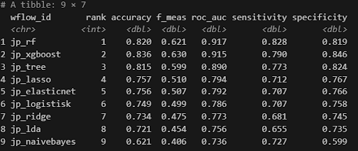{#fig-model-rangering width="80%"}

ROC AUC blev valgt som primær rank-metrik fordi vores datasæt er ubalanceret med flere ikke-churnere end churnere. Accuracy ville i den situation favorisere modeller der blot gætter på majoritetsklassen, mens ROC AUC måler modellens evne til at rangordne kunder korrekt på tværs af alle mulige klassifikation grænser, uanset hvilken threshold man ender med at anvende.
Men i en forretningsmæssig kontekst som denne, er det sensitivity der er den afgørende evalueringsmetrik. Sensitivity måler andelen af faktiske churnere som modellen korrekt identificerer, og en false negative, en churner vi overser, er den dyreste fejl: JP mister en abonnent uden at have haft mulighed for at handle. Derfor er Random Forest ikke kun valgt fordi den er bedst på ROC AUC, men fordi den samtidig leverer den højeste sensitivity på 0.828 under krydsvalidering, og 0.841 på det endelige testdata, som ses på figur 2. Det betyder at modellen fanger 84% af de kunder der faktisk churner. XGBoost scorer til sammenligning 0.790 på sensitivity, hvilket er et markant lavere niveau når formålet er at minimere oversete churnere.
Der er dog en indbygget spænding mellem de to metrikker. En høj sensitivity opnås typisk på bekostning af specificity, modellen bliver mere tilbøjelig til at klassificere kunder som churnere, også selvom de ville have fortsat. Vores model har en specificity på 0.753 som set på figur 2, hvilket betyder at cirka 25% af de faktiske fortsættere markeres ved fejl som churnere. Det koster ressourcer i unødvendige fastholdelses kampagner, men er en acceptabel trade-off når alternativet er at overse churnere. Denne afvejning er en bevidst og eksplicit prioritering i projektet: vi optimerer til sensitivity, men bruger ROC AUC til at sikre at vi vælger en model der er god til at skelne mellem de to kundegrupper som helhed.
De simple lineære modeller, logistisk regression, Ridge, Lasso og LDA, klarer sig markant dårligere, særligt på F1-score og sensitivity, hvilket tyder på at churn-mønstrene i data ikke er lineære. Det retfærdiggør brugen af tree-based metoder. Naive Bayes scorer lavest på specificity 0.599 og relativt lavt på ROC AUC 0.736, fordi den antager fuld feature-uafhængighed, hvilket er en urealistisk antagelse i et datasæt hvor adfærdsvariabler som aktivitetsdage og sidevisninger naturligt korrelerer.
Efter at have identificeret Random Forest som den bedste model, blev modellen færdiggjort og evalueret på testdata. De optimale hyperparametre blev valgt med select_best baseret på ROC AUC, og modellen blev derefter fittet igen på det fulde træningssæt og evalueret på testdata via last_fit.

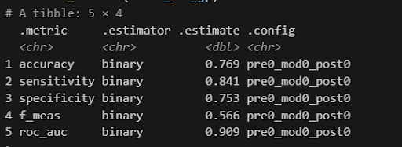{#fig-jp-testdata width="80%"}

Resultatet på testdata viser en ROC AUC på 0.909, marginalt lavere end 0.917 under bootstrapping, hvilket indikerer generaliseringsevne uden tegn på overfitting. Sensitivity på 0.841 bekræfter at modellen fanger 84% af faktiske churnere. Specificity på 0.753 betyder at cirka en fjerdedel af faktiske fortsættere fejlagtigt markeres som churnere, en acceptabel trade-off når sensitivity er den primære metrik. F1-scoren på 0.566 er lav som følge af at testdata fortsat er ubalanceret, og er derfor den mindst retvisende metrik i denne sammenhæng.

\newpage
### Churn prædiktion pr. kunde
```{r}
#| label: churn prædiktion per kunde
#| echo: true
#| eval: false

# *******************************************************************************************
#                  Spørgsmål 1 & 2: Individuelle prædiktioner pr. kunde                  ----
# *******************************************************************************************

# Hent sandsynligheder fra testdata
# Ved .pred_1 = sandsynlighed for at churne
# Ved .pred_0  = sandsynlighed for at fortsætte
prædiktioner <- collect_predictions(final_fit_jp) |> 
  select(.row, .pred_class, .pred_1, .pred_0, churned)

# Kunder der sandsynligvis churner
sandsynlige_churnere <- prædiktioner |> 
  filter(.pred_class == "1") |> 
  arrange(desc(.pred_1))

cat("Kunder der sandsynligvis churner\n")
print(sandsynlige_churnere)

# Kunder der sandsynligvis fortsætter 
sandsynlige_fortsættere <- prædiktioner |> 
  filter(.pred_class == "0") |> 
  arrange(desc(.pred_0))

cat("Kunder der sandsynligvis fortsætter\n")
print(sandsynlige_fortsættere)
```

\newpage
### Fortsættere i risiko for churn
```{r}
#| label: Fortsættere i risiko for churn
#| echo: true
#| eval: false
# *******************************************************************************************
#                Spørgsmål 3: Hvilke "fortsættere" er i risiko for sen churn?            ----
# *******************************************************************************************
# Tager de abonnenter der er prædikteret til at fortsætte,
# men som stadig har en relativt høj churn-sandsynlighed
# Vi bruger 0.3 som grænse
sen_churn_risiko <- sandsynlige_fortsættere |> 
  filter(.pred_1 > 0.3) |> 
  arrange(desc(.pred_1))

cat("Spørgsmål 3: Fortsættere med høj risiko for sen churn\n")
print(sen_churn_risiko)

# Vi laver Confusion Matrix på testdata
collect_predictions(final_fit_jp) |> 
  conf_mat(truth = churned, estimate = .pred_class)

# ROC kurve for den bedste model
collect_predictions(final_fit_jp) |> 
  roc_curve(truth = churned, .pred_1) |> 
  autoplot() +
  ggtitle(paste("ROC kurve -", bedste_jp_id))

# Variable importance for den bedste model
extract_workflow(final_fit_jp) |> 
  extract_fit_parsnip() |> 
  vip::vip(geom = "col")
```

Modellen anvendes ikke blot til at identificere abonnenter med høj umiddelbar churnrisiko, men også til at skelne mellem sikre fortsættere og fortsættere med forhøjet risiko for fremtidig opsigelse. Ved at filtrere de abonnenter, som modellen predictor vil fortsætte, men som samtidig har en churn sandsynlighed over 0.30, identificeres et segment af sårbare fortsættere der ikke umiddelbart fremstår som risikogruppe. Disse abonnenter har tilsyneladende konverteret succesfuldt, men befinder sig stadig tæt på den grænse, hvor en enkelt negativ oplevelse eller faldende engagement kan være årsagen til en opsigelse. Dette segment er derfor særligt relevant for JP’s kommercielle afdeling, da en proaktiv indsats her kan fastholde de abonnenter, der ellers ville være gået tabt.

\newpage
## Confusion Matrix i forretningskontekst:
Confusion matrixet viser hvordan modellen klassificerer de 385 abonnenter i testdata fordelt på fire udfald.

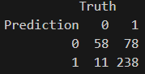{#fig-jp-cm width="35%"}

**238 True Positives** er de abonnenter, modellen korrekt identificerer som churnere. Det er dem JP har største forretningsmæssig interesse i at fange, da en god fastholdelsesstrategi her kan redde et abonnement og succesfuldt opnå en konvertering.

**78 False Negatives** er den værste fejl i samme kontekst. Det er abonnenter der faktisk churner, men som vores model overser. Disse abonnenter forlader platformen uden at JP har haft en mulighed for at reagere, hvilket udgør et direkte og uundgåeligt tab.

**11 False Positives** er abonnenter som modellen fejlagtigt markerer som churnere, selvom de ville have fortsat. Det er abonnenter som vil unødigt modtage e-mails eller andre fastholdelses kampagner, hvilket koster ressourcer, men er en relativt lille omkostning sammenlignet med false negatives.

**58 True Negatives er** abonnenter modellen korrekt identificeret som fortsættere, derfor kræver det ingen handling fra JP at arbejde på disse.

Forholdet mellem 78 False Negatives og 11 False Positives er ikke en tilfældighed, men en direkte konsekvens af vores metodiske valg i recipe og modelvalg, hvor downsampling og fokus på sensitivity trækker modellen mod at klassificere flere abonnenter som churnere, hvilket betyder at vi fanger flere reelle opsigelser, men til gengæld kører fastholdelseskampagner på nogle kunder der alligevel ville have fortsat.

\newpage
## Klyngeanalyse & kundeprofiler:
```{r}
#| label: klyngeanalyse kmeans og hierakisk
#| echo: true
#| eval: false

# *******************************************************************************************
#                                        Klyngeanalyse                                   ----
# *******************************************************************************************
##                                         K-means                                       ----
# *******************************************************************************************
jp_cluster_vars <- model_data |> 
  select(
    age_at_order,
    account_active_days,
    page_views,
    avg_scroll,
    days_with_activity,
    newsletter_growth,
    previous_subscriptions
  ) |> 
  drop_na()

jp_cluster_scaled <- scale(jp_cluster_vars)

# Kører kmeans 6 gange, med nstart 100 kører vi 100 
# forskellige startpunkter for at finde det optimale
elbow <- map_dbl(1:6, function(k) {
  set.seed(42)
  kmeans(jp_cluster_scaled, centers = k, nstart = 100)$tot.withinss
})

plot(1:6, elbow, 
  type = "b",
  pch = 19,
  xlab = "Antal klynger (k)",
  ylab = "Total within-cluster sum of squares",
  main = "Elbow-metode: optimalt antal klynger")

set.seed(42)
jp.out <- kmeans(jp_cluster_scaled, centers = 3, nstart = 100)

# Tjek klyngerne — størrelse og spredning
jp.out$size
jp.out$tot.withinss
jp.out$withinss

# *******************************************************************************************
##                                       Hierarkisk                                      ----
# *******************************************************************************************
# Hierarkisk clustering med 3 linkage-metoder — som underviserens tilgang
jp_hclust_complete <- hclust(dist(jp_cluster_scaled), method = "complete")
jp_hclust_average  <- hclust(dist(jp_cluster_scaled), method = "average")
jp_hclust_single   <- hclust(dist(jp_cluster_scaled), method = "single")

# Viser alle tre side om side så vi kan sammenligne
par(mfrow = c(1, 3))
plot(jp_hclust_complete, main = "Complete Linkage", xlab = "", sub = "", labels = FALSE, hang = -1)
plot(jp_hclust_average,  main = "Average Linkage",  xlab = "", sub = "", labels = FALSE, hang = -1)
plot(jp_hclust_single,   main = "Single Linkage",   xlab = "", sub = "", labels = FALSE, hang = -1)
par(mfrow = c(1, 1))

# Vi bruger complete til videre analyse, da den typisk giver de mest balancerede klynger
rect.hclust(jp_hclust_complete, k = 3, border = c("#E69F00", "#0072B2", "#009E73"))

# Sammenlign k-means og hierarkisk
table(
  kmeans = jp.out$cluster,
  hclust = cutree(jp_hclust_complete, k = 3)
)

# Kombiner klynge-labels med de originale uskalerede data 
jp_cluster <- data.frame(jp_cluster_vars, klynge = as.factor(jp.out$cluster))

# Laver klyngeprofil
jp_cluster_profile <- jp_cluster |> 
  group_by(klynge) |> 
  summarise(
    age_at_order           = mean(age_at_order),
    account_active_days    = mean(account_active_days),
    page_views             = mean(page_views),
    avg_scroll             = mean(avg_scroll),
    days_with_activity     = mean(days_with_activity),
    newsletter_growth      = mean(newsletter_growth),
    previous_subscriptions = mean(previous_subscriptions)
  )

print(jp_cluster_profile)

# Visualisér klyngeprofiler som grouped barchart 
jp_cluster_profile |> 
  gather("Feature", "Gennemsnit", -klynge) |> 
  ggplot(aes(Feature, Gennemsnit, fill = klynge)) +
  geom_bar(position = "dodge", stat = "identity") +
  theme(axis.text.x = element_text(angle = 45, hjust = 1)) +
  labs(
    title = "Klyngeprofiler — JP abonnenter",
    x     = "",
    fill  = "Klynge"
  )

# Tilføj churnrate per klynge 
model_data_cluster <- model_data |> 
  drop_na(age_at_order, account_active_days, page_views,
          avg_scroll, days_with_activity, 
          newsletter_growth, previous_subscriptions) |> 
  mutate(klynge = as.factor(jp.out$cluster))

model_data_cluster |> 
  group_by(klynge) |> 
  summarise(
    antal      = n(),
    churn_rate = mean(churned == "1") |> round(2)
  )
```

Klyngeanalysen har til formål at udpege tre distinkte kundesegmenter blandt JP’s abonnenter, der adskiller sig markant på adfærd, engagement og churnrisiko.

Klynge 1, de aktive er en mellemstor gruppe bestående af 389 abonnenter med en gennemsnitsalder på 61 år, et moderat aktivitetsniveau på 415 dage og det højeste antal sidevisninger på 462. Disse kunder er de meste klikaktive og browsende i deres adfærd, men deres scroll depth er den laveste af de tre klynger på 0.313, hvilket tyder på at de skimmer meget indhold og mange artikler, uden nødvendigvis at læse det til bunds. Churn sandsynligheden ligger på 0.596, de repræsenterer et segment der er engageret men ikke nødvendigvis loyale på længere sigt.

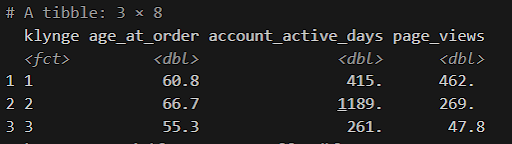{#fig-klynge-resultater width="80%"}

Klynge 2, de loyale er den mest erfarne gruppe bestående af 229 abonnenter med en gennemsnitsalder på 67 år og markant flest aktive dage på 1.189. Abonnenterne har en loyal relation til JP og har sandsynligvis været abonnenter i lang tid. Modellen vurderer dem som den gruppe med mindst churnrisiko, med en gennemsnitlig churn-sandsynlighed på 0.520. Deres moderate antal sidevisninger, 269, tyder på en stabil men ikke intensivt læseadfærd. 

Klynge 3, de passive, er den største gruppe på 661 abonnenter med en gennemsnitsalder på 55 år og det laveste aktivitetsniveau på 261 dage og kun 48 sidevisninger. På trods af dette har gruppen den højeste scroll depth på 0.434, de læser grundigt når de er der, men er der sjældent. Dette skyldes sandsynligvis kunder der er tilmeldt via kampagne og aldrig har opbygget en daglig læsevane. Det kan ses i tallene med den højeste churnrate på 87% og højeste gennemsnitlige churn sandsynlighed på 0.755. Derfor kan vi konkludere at klynge 3 er den mest relevante risikogruppe og det naturlige mål for fastholdelsesstrategier og kampagner.

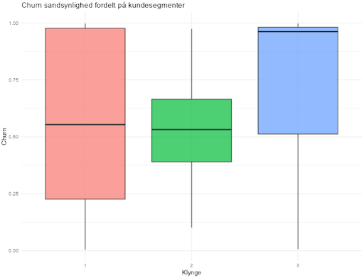{#fig-klynge-boxplot width="80%"}

\newpage
## Klyngeanalyse til ML-model
En observation er at churnraten er høj på tværs af alle tre klynger, 77%, 78% og 87%, hvilket indikerer at churn er et udbredt problem på tværs af segmenterne. Forskellen ligger i graden af risiko og i hvad der driver den. Klynge 3 er det fraværet af en etableret læsevane. Hos klynge 1 er det overfladiske engagement mønster trods høj aktivitet. Klynge 2 er relativt sikker som gruppe, men selv her churner næsten 4 ud af 5 abonnenter.

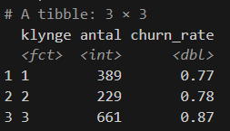{#fig-klynge-churnrate width="40%"}

\newpage
### Kundeprofiler kode
```{r}
#| label: kundeprofiler
#| echo: true
#| eval: false

# *******************************************************************************************
#                    Spørgsmål 5: Kundeprofiler koblet til prædiktioner                  ----
# *******************************************************************************************
# Tilføjer de rækker der bruges i klyngeanalysen
cluster_rows <- model_data |> 
  drop_na(age_at_order, account_active_days, page_views,
          avg_scroll, days_with_activity,
          newsletter_growth, previous_subscriptions)

# Lav prædiktioner KUN på de samme rækker
cluster_prædiktioner <- predict(
  extract_workflow(final_fit_jp),
  new_data = cluster_rows,
  type     = "prob"
)

# Tilføjer klynge-labels
model_data_profil <- cluster_rows |> 
  mutate(
    klynge              = as.factor(jp.out$cluster),
    churn_sandsynlighed = cluster_prædiktioner$.pred_1
  )

# Kundeprofil: én række pr. klynge med de vigtigste nøgletal
kundeprofil <- model_data_profil |> 
  group_by(klynge) |> 
  summarise(
    antal                   = n(),
    churnrate               = mean(churned == "1") |> round(2),
    gns_churn_sandsynlighed = mean(churn_sandsynlighed) |> round(3),
    gns_age_at_order        = mean(age_at_order) |> round(1),
    gns_active_days         = mean(account_active_days) |> round(1),
    gns_page_views          = mean(page_views) |> round(1),
    gns_scroll              = mean(avg_scroll) |> round(2),
    gns_days_with_activity  = mean(days_with_activity) |> round(1),
    .groups = "drop"
  )

print(kundeprofil)

# Churn sandsynlighed pr. klynge som boxplot
ggplot(model_data_profil, aes(x = klynge, y = churn_sandsynlighed, fill = klynge)) +
  geom_boxplot(alpha = 0.7) +
  labs(
    title = "Churn sandsynlighed fordelt på kundesegmenter",
    x     = "Klynge",
    y     = "Churn",
    fill  = "Klynge"
  ) +
  theme_minimal() +
  theme(legend.position = "none")
```

\newpage
### Feature Importance kode
```{r}
#| label: feature-mportance
#| echo: true
#| eval: false

# *******************************************************************************************
#                    Spørgsmål 4: Hvilke features forklarer churn bedst?                 ----
# *******************************************************************************************
importance <- extract_workflow(final_fit_jp) |> 
  extract_fit_parsnip() |> 
  vi() |> 
  arrange(desc(Importance))

print(importance, n = Inf)

# Top-15 features
importance |> 
  slice_max(Importance, n = 15) |> 
  ggplot(aes(x = reorder(Variable, Importance), y = Importance)) +
  geom_col(fill = "#1D9E75", alpha = 0.8) +
  coord_flip() +
  labs(
    title = "Top 15 features: Hvad driver churn?",
    x     = "",
    y     = "Importance"
  ) +
  theme_minimal()
```

\newpage
Dette understøtter det fund fra feature-importance-analysen, at account_active_days er den dominerende predictor for churn. Klynge 2’s markant højere aktivitetsniveau på 1.189 mod klynge 3’s 261, er det, der adskiller den laveste og højeste churnrisiko. Det skal dog bemærkes at klyngeanalysen er bygget på de samme features som ML-modellen, så det er ikke overraskende at begge analyser giver lignende resultater, for at få en uafhængig validering ville det kræve et separat datasæt. Adfærdsmæssig integration i hverdagen er derfor den stærkeste faktor mod churn, og det mest konkrete parameter JP kan forsøge at påvirke gennem målrettet aktivering i indholdet af artikler tidligt i abonnementsforløbet.

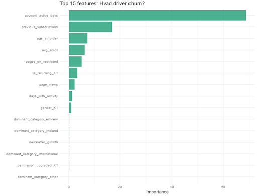{#fig-feature-importance width="75%"}

\newpage
## Bias & Gennemsigtighed:
Brugen af ML til profilering af abonnenter rejser centrale spørgsmål om gennemsigtighed og bias, som projektet forholder sig til på flere niveauer. I forhold til hvad der er gjort for at imødekomme disse udfordringer, er der truffet tre konkrete metodiske valg. Det første er at vi anvender downsampling i vores recipe for at modvirke klassebias, så modellen ikke blot lærer at favorisere majoritetsklassen af ikke-churnere. Det andet er den simpleste arkitektur valgt i det neurale netværk netop med gennemsigtighed som eksplicit begrundelse, da en mere kompleks model ville øge mængden af databehandling og dermed gøre det sværere at validere og overvåge modellens adfærd i praksis. Det tredje og sidste valg er anvendelsen af feature importance som konkret forklaringsværktøj, der giver JP’s kommercielle afdeling indsigt i hvilke faktorer der vejer tungest i modellens forudsigelser.

Modellen kan dog ikke beskytte sig mod bias i selve træningsdata. Er bestemte segmenter systematisk overrepræsenterede i opsigelsesdata af strukturelle årsager, vil modellen lære mønstrene som churn signaler og dermed risikere at målrette fastholdelsesstrategier imod specifikke grupper som ikke behøves at udsættes for kampagner og tilbud. Derudover forbliver Random Forest og det neurale netværk opererer begge som såkaldte “Black-Box” modeller, hvor den fulde logik bag en enkelt prædiktion ikke kan forklares direkte til den abonnent, der er blevet profileret. Dette ender både med etiske og juridiske udfordringer i forhold til GDPR art. 22 om automatiserede afgørelser, og understreger vigtigheden af at modellens output anvendes som grundlag for menneskelige beslutninger frem for endelige afgørelser.

\newpage
## Evaluering af modellen:
Projektets forretningsmål var at udvikle et ML værktøj der kunne identificere kampagneabonnenter med høj churnrisiko. Random Forest modellen fanger 84% af de faktiske churnere med en ROC AUC på 0.909, mens det neurale netværk supplerer med en precision på 0.91. De to modeller dækker derfor forskellige behov, Random Forest minimerer oversete churnere, mens det neurale netværk minimerer “falske alarmer”. 

Klyngeanalysen gør en differentieret fastholdelsesstrategi mulig, Klynge 3 er den vigtigste risikogruppe at arbejde med, grundet en churnrate på 87%, mens klynge 2’s lavere churn sandsynlighed på 0.520 tyder på disse abonnenters churn i højere grad skyldes livsstil frem for manglende engagement.

Feature Importance-analysen viser et mønster hvor at adfærdsvariabler dominerer markent over demografiske faktorer som forklaring på churn. Account_active_days er den stærkeste predictor med en importance score på 68.8, efterfulgt af previous_subscriptions på 16.8. Demografiske variabler som age_at_order placerer sig på en tredjeplads med 7.12, mens køn gender_X1 ligger markant lavere på score med kun 1.18. Dette indikerer, at det primært er abonnentens adfærd og er historisk med JP, der forudsiger churn, frem for hvem abonnenten er demografisk set. Alder har en vis forklaringskraft, det kan skyldes at det yngre segment i højere grad tiltrækkes af kampagnetilbud uden intention om at konvertere, mens køn næsten ingen betydning har når adfærdsdata er tilgængelig. Derfor er JP’s mest effektive fastholdelsestiltag ikke en demografisk målretning, men indholds aktivering der bygger på daglige læsevaner og adfærd, med fokus på at gøre det tidligt i abonnementsforløbet, eller starten af en kampagne.

På baggrund af at account_active_days er den dominerende predictor for churn , peger analysen på at JP bør fokusere på at skabe daglige kontaktpunkter tidligt i kampagneforløbet. Det kunne eksempelvis være en onboarding-serie der guider nye abonnenter til relevant indhold de første 2-4 uger, men hvilken konkret indsats der virker bedst ville kræve tests og supplerende analyser.

\newpage
# Neurale Netværk
Med ønsket om at undersøge om et neuralt netværk kan prædiktere kundechurn bedre end de tidligere afprøvede metoder, opbygges og sammenlignes fem forskellige DL modeller med stigende kompleksitet. Til at starte med importeres de nødvendige pakker, hvorefter datasættet indlæses og struktureres med henblik på modellering. Variablerne er på forhånd organiseret efter type i R, hvilket gør det nemmere at opdele datasættet i binære dummyvariabler, én kategorisk variabel og kvantitative variabler. Den kategoriske variabel one-hot encodes uden at udelade nogen kategorier, hvilket sikrer, at modellen får fuld information om alle niveauer, hvorefter alle feature-typer samles i en samlet feature matrix. Datasættet opdeles dernæst i trænings- og testsæt med stratificering på targetvariablen, så klassefordelingen bevares i begge splits.

Med datasættet indlæst og opdelt, begynder vi nu med at afprøve nogle forskellige arkitekturer. Da vi har at gøre med relativt få observationer og variabler starter vi ud med nogle meget simple arkitekturer med få hidden layers, uden alt for mange neuroner og blot 50 epochs for at undgå overfitting. Desuden har vi en meget stor ubalance i vores targetvariabels klasser hvor majoritetsklassen (som i dette tilfælde er at kunden er churnet) fylder væsentligt mere end minoritetsklassen. Class weight balancering bruges derfor for at straffe modellen hårdere når den laver fejl på minoritetsklassen. 

I Python bruger vi her ”compute_class_weight” fra sk.learn med en class_weight på ”balanced”:

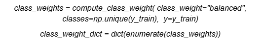{#fig-class-weights width="100%"}

Den første model der trænes, har blot 2 lag med hhv. 64 og 32 neuroner, og allerede her får vi faktisk nogle rigtig fine resultater. Med en test AUC på 0.88, precision på 0.91 og recall på 0.89 er det endda også et bedre resultat end det vi fik fra vores random forest model.
Selvom vi allerede får gode resultater, er vi selvfølgelig ikke sikre på om vi skal være helt tilfredse med det endnu og vi arbejder derfor videre med det ved at udvide modellen gradvist. Eksempelvis trænes den næste model stadig med 2 lag, men nu på hhv. 128 og 64 neuroner, dropouts mellem lagene og flere epochs med early stopping. Modellen derefter udvides så yderligere ved at introducere et nyt lag, og derefter introduceres også batch normalization og L2 regularisering. Ved at benytte denne fremgangsmåde, hvor vi startede simpelt og gradvist forøgede modellens kompleksitet, kan vi løbende evaluere, om de ekstra lag og hyperparametre faktisk bidrager med en reel forbedring, eller blot øger risikoen for overfitting. Samtidig giver det et bedre overblik over, hvilke ændringer der har en effekt på modellens performance.

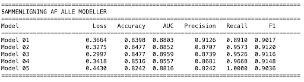{#fig-python-modeller width="100%"}

Når vi sammenligner performance på tværs af modellerne, ser vi generelt at forskellene i  accuracy og AUC er relativt små. Målt på AUC er det model 3 der opnår den højeste score på 0.8959 og laveste loss på 0.2997, hvilket jo sagtens kunne indikere at denne model har den overordnede bedste performance. Forbedringen i performance i forhold til de simplere modeller er dog begrænset, og vi ser samtidig at de mere komplekse modeller ikke nødvendigvis performer bedre på alle metrikker. Model 04 har eksempelvis en lavere AUC på trods af højere kompleksitet, og model 05 opnår en recall på 1.0, men på bekostning af en betydeligt lavere precision og det største loss blandt alle modellerne. Alt dette understreger en vigtig pointe: nemlig at øget kompleksitet ikke nødvendigvis fører til at modellen performer bedre på alle metrikkerne. Vores resultater tyder tværtimod på at de mere avancerede arkitekturer begynder at overfitte eller skabe stor ubalance mellem precision og recall. Model 05 er et ekstremt tilfælde, hvor modellen lærer at klassificere næsten alle observationer som churned, og dermed opnår en perfekt recall, men med en markant lavere precision og dermed mindre praktisk anvendelighed.

I denne kontekst hvor vi har at gøre med churn, er precision netop også ret vigtig, da en positiv prædiktion (altså at vi predictor at kunden vil churne) typisk vil udløse en eller form for retention handling eller kontakt. Derfor vil vi gerne minimere antallet af falske positive, for både at spare ressourcer tid, men også undgå unødvendig spam og kontakt til kunder der egentligt ikke havde i sinde at opsige. Det vil sige, at vi hellere vil være sikre på, at de kunder vi identificerer som en churn-risiko faktisk er i risiko, frem for at fange potentielle ikke-churnere.

På baggrund af dette fremstår Model 01 som det bedste valg til denne case. Selvom den ikke har den højeste AUC eller laveste loss, opnår den den højeste precision på 0.9126 samtidig med at den stadig har en relativt stærk og balanceret recall på 0.8910. Derudover er det den simpleste arkitektur, hvilket gør den mere robust, lettere at fortolke og mindre tilbøjelig til overfitting. Modellens simplicitet er også særligt relevant, da de her DL-modeller typisk kan betegnes som ”black boxes”, hvor vi i princippet ikke rigtigt kan forklare hvad der sker i modellen og hvordan den behandler dataen, hvilket kan rejse en række etiske problemstillinger. Ved at benytte den simpleste model, minimeres derfor også mængden af databehandling og dermed mindskes kompleksiteten i de mønstre modellen kan lære, hvilket gør den mindre tilbøjelig til at opfange støj eller tilfældige sammenhænge. Dette reducerer samtidig risikoen for at forudsigelserne baseres på uønskede eller potentielt problematiske mønstre, som kan være næsten umulige at identificere og forklare efterfølgende. Med en simplere model er det også nemmere at validere og overvåge dens performance i praksis, da outputtet i højere grad kan tillægges de konkrete inputvariabler. Alligevel, når vi har at gøre med en DL-model som denne, vil den stadig ikke være fuldt fortolkelig, men vi bevæger os i retning af en mere transparent og kontrollerbar løsning. I en forretningskontekst som denne hvor vi snakker churn, er dette en ret vigtig pointe, idet modellens resultater kan danne grundlag for konkrete beslutninger rettet mod kunderne og vi derfor gerne vil agere ansvarligt med deres data.

Samlet set peger analysen derfor på, at en relativt simpel model, kombineret med en håndtering af klasseubalance, er nok til at opnå en stærk og stabil performance. Yderligere kompleksitet opnår kun marginale forbedringer i enkelte metrikker, men øger samtidig risikoen for dårligere generalisering og mindre pålidelige prædiktioner i praksis.

```{python}
#| label: import af data
#| echo: true
#| eval: false

import pandas as pd
import numpy as np
from sklearn.model_selection import train_test_split
from sklearn.preprocessing import StandardScaler
from tensorflow.keras.models import Sequential
import tensorflow as tf
from tensorflow import kerasv
from tensorflow.keras import layers, regularizers
from tensorflow.keras import backend as K
from tensorflow.keras.callbacks import EarlyStopping, ReduceLROnPlateau
from tensorflow.keras.optimizers import Adam
from sklearn.utils.class_weight import compute_class_weight
df = pd.read_csv("model_data.csv")

cols       = df.columns.tolist()
target_col = cols[0]
dummy_cols = cols[1:4]
cat_col    = cols[5]
quant_cols = cols[6:]

# Konvertér binære kolonner — fyld NaN med mode før int-cast
for col in dummy_cols:
    df[col] = pd.to_numeric(df[col], errors="coerce")
    df[col] = df[col].fillna(df[col].mode()[0])
    df[col] = df[col].astype(int)

y = df[target_col].astype(int).values    # ← astype(int) tilføjet

# One-hot encoding af kategorisk variabel — drop_first=False bevarer ALLE kategorier
dom_dummies = pd.get_dummies(
    df[cat_col].astype(str), prefix=cat_col, drop_first=False
)

# Saml: dummy-kolonner | one-hot-kolonner | kvantitative kolonner
X_df = pd.concat([df[dummy_cols], dom_dummies, df[quant_cols]], axis=1)

# ── 4. Opdel i trænings- og testsæt (80/20) FØR skalering ──────────────────
X_train_df, X_test_df, y_train, y_test = train_test_split(
    X_df, y, test_size=0.20, random_state=1245, stratify=y
)

scaler      = StandardScaler()
X_train_arr = X_train_df.copy()
X_test_arr  = X_test_df.copy()

X_train_arr[quant_cols] = scaler.fit_transform(X_train_df[quant_cols])  # fit + transform
X_test_arr[quant_cols]  = scaler.transform(X_test_df[quant_cols])       # kun transform

# Træningsdata: Her beregnes gennemsnit og standardafvigelse, og data skaleres (fit_transform).
# Testdata: Her bruges de allerede beregnede værdier fra træningsdata til at skalere testdata (transform).
# Dette forhindrer data leakage og sikrer, at modellen kun "ser" træningsdata under preprocessing.

# Konvertér til numpy float32 arrays (Keras-format)
X_train = X_train_arr.values.astype(np.float32)
X_test  = X_test_arr.values.astype(np.float32)

resultater = {}

# =============================================================================
# MODEL 01 — Simpel baseline
# =============================================================================
# Den enklest mulige arkitektur: to skjulte lag uden regularisering.
# Bruges som baseline — alle efterfølgende modeller bør slå denne.
# Ingen dropout eller batch normalization — risikerer overfitting.
K.clear_session()
tf.random.set_seed(42)

model_01 = keras.Sequential([
    layers.Input(shape=(X_train.shape[1],)),    # Inputlag: antal features
    layers.Dense(64, activation="relu"),        # Skjult lag 1: 64 neuroner, ReLU aktivering
    layers.Dense(32, activation="relu"),        # Skjult lag 2: 32 neuroner, ReLU aktivering
    layers.Dense(1,  activation="sigmoid")      # Outputlag: sigmoid giver P(churnet) ∈ [0,1]
], name="model_01")

# binary_crossentropy er standardtabsfunktionen til binær klassifikation.
# Adam er en adaptiv optimizer der justerer learning rate per parameter.
model_01.compile(
    optimizer="adam",
    loss="binary_crossentropy",
    metrics=["accuracy", tf.keras.metrics.AUC(name="auc"),
             tf.keras.metrics.Precision(), tf.keras.metrics.Recall()]
)
model_01.summary()

class_weights = compute_class_weight(
    class_weight="balanced",
    classes=np.unique(y_train),
    y=y_train
)
class_weight_dict = dict(enumerate(class_weights))

history_01 = model_01.fit(
    X_train, y_train,
    class_weight=class_weight_dict,
    epochs=50,
    batch_size=64,                  # 64 observationer per gradient-opdatering
    validation_split=0.20,          # 20% af træningsdata til løbende validering

    verbose=1
)

loss, acc, auc, precision, recall = model_01.evaluate(X_test, y_test, verbose=0)
resultater["Model 01"] = {"loss": loss, "accuracy": acc, "auc": auc,
                           "precision": precision, "recall": recall}
print(f"\nModel 01 → Loss: {loss:.4f} | Acc: {acc:.4f} | AUC: {auc:.4f} | Precision: {precision:.4f} | Recall: {recall:.4f}")

# =============================================================================
# MODEL 02 — Dropout regularisering
# =============================================================================
# Tilføjer Dropout til baseline-arkitekturen. Dropout slukker tilfældigt en
# andel af neuroner under træning, hvilket tvinger netværket til at lære mere
# robuste representationer og reducerer overfitting.
# Dropout(0.3) = 30% af neuroner deaktiveres i hvert træningsskridt.
K.clear_session()
tf.random.set_seed(42)

model_02 = keras.Sequential([
    layers.Input(shape=(X_train.shape[1],)),
    layers.Dense(128, activation="relu"),       # Større første lag end model_01
    layers.Dropout(0.3),                        # 30% dropout efter lag 1
    layers.Dense(64, activation="relu"),
    layers.Dropout(0.2),                        # 20% dropout efter lag 2
    layers.Dense(1, activation="sigmoid")
], name="model_02")

model_02.compile(
    optimizer="adam",
    loss="binary_crossentropy",
    metrics=["accuracy", tf.keras.metrics.AUC(name="auc"),
             tf.keras.metrics.Precision(), tf.keras.metrics.Recall()]
)
model_02.summary()

# EarlyStopping: stopper træning hvis val_loss ikke forbedres i 5 epochs
# restore_best_weights=True ruller tilbage til den bedste epoch ved stop
early_stopping_02 = EarlyStopping(
    monitor="val_loss",
    patience=5,
    restore_best_weights=True
)

class_weights = compute_class_weight(
    class_weight="balanced",
    classes=np.unique(y_train),
    y=y_train
)

history_02 = model_02.fit(
    X_train, y_train,
    epochs=100,                         # EarlyStopping stopper før hvis nødvendigt
    batch_size=64,
    validation_split=0.20,
    callbacks=[early_stopping_02],
    verbose=1
)

loss, acc, auc, precision, recall = model_02.evaluate(X_test, y_test, verbose=0)
resultater["Model 02"] = {"loss": loss, "accuracy": acc, "auc": auc,
                           "precision": precision, "recall": recall}
print(f"\nModel 02 → Loss: {loss:.4f} | Acc: {acc:.4f} | AUC: {auc:.4f} | Precision: {precision:.4f} | Recall: {recall:.4f}")

# =============================================================================
# MODEL 03 — Dybere netværk + blødgjorte class weights + t=0.40
# =============================================================================
# Tilføjer et ekstra skjult lag ift. model_02 og bruger blødgjorte class weights
# ({0:2.0, 1:0.8}) frem for "balanced". Dette løfter Recall markant fordi
# modellen ikke overkompenserer for majoritetsklassen.
# Threshold sættes til 0.40 (frem for standard 0.50) da threshold-analysen
# viste at t=0.40 giver den bedste F1-score og højeste accuracy.
K.clear_session()
tf.random.set_seed(42)

model_03 = keras.Sequential([
    layers.Input(shape=(X_train.shape[1],)),
    layers.Dense(64, activation="relu"),        # Lag 1
    layers.Dropout(0.3),
    layers.Dense(64, activation="relu"),        # Lag 2 — samme størrelse som lag 1
    layers.Dropout(0.3),
    layers.Dense(32, activation="relu"),        # Lag 3 — reducerer til 32 neuroner
    layers.Dropout(0.2),
    layers.Dense(1, activation="sigmoid")
], name="model_03")

model_03.compile(
    optimizer="adam",
    loss="binary_crossentropy",
    metrics=["accuracy", tf.keras.metrics.AUC(name="auc"),
             tf.keras.metrics.Precision(), tf.keras.metrics.Recall()]
)
model_03.summary()

# EarlyStopping: stopper træning hvis val_loss ikke forbedres i 5 epochs
# restore_best_weights=True ruller tilbage til den bedste epoch ved stop
early_stopping_03 = EarlyStopping(
    monitor="val_loss",
    patience=5,
    restore_best_weights=True
)

class_weights = compute_class_weight(
    class_weight="balanced",
    classes=np.unique(y_train),
    y=y_train
)

history_03 = model_03.fit(
    X_train, y_train,
    epochs=150,                         # EarlyStopping stopper før hvis nødvendigt
    batch_size=64,
    validation_split=0.20,
    callbacks=[early_stopping_03],
    verbose=1
)

loss, acc, auc, precision, recall = model_03.evaluate(X_test, y_test, verbose=0)
resultater["Model 03"] = {"loss": loss, "accuracy": acc, "auc": auc,
                           "precision": precision, "recall": recall}
print(f"\nModel 03 → Loss: {loss:.4f} | Acc: {acc:.4f} | AUC: {auc:.4f} | Precision: {precision:.4f} | Recall: {recall:.4f}")

# =============================================================================
# MODEL 04 — Batch Normalization
# =============================================================================
# Erstatter ren dropout med Batch Normalization (BN). BN normaliserer
# aktiveringsmønstret inden for hvert lag per batch, hvilket stabiliserer
# træningen og kan tillade højere learning rates. BN placeres MELLEM Dense-laget
# og aktiveringsfunktionen for bedste effekt. Batch size 32 (frem for 64) giver
# BN bedre estimater af mean og variance per batch.
K.clear_session()
tf.random.set_seed(42)

model_04 = keras.Sequential([
    layers.Input(shape=(X_train.shape[1],)),
    layers.Dense(128, activation=None),         # Ingen aktivering — BN kommer først
    layers.BatchNormalization(),                # Normaliserer inden aktivering
    layers.Activation("relu"),
    layers.Dropout(0.2),
    layers.Dense(64, activation=None),
    layers.BatchNormalization(),
    layers.Activation("relu"),
    layers.Dropout(0.3),
    layers.Dense(1, activation="sigmoid")
], name="model_04")

model_04.compile(
    optimizer="adam",
    loss="binary_crossentropy",
    metrics=["accuracy", tf.keras.metrics.AUC(name="auc"),
             tf.keras.metrics.Precision(), tf.keras.metrics.Recall()]
)
model_04.summary()

# EarlyStopping: stopper træning hvis val_loss ikke forbedres i 5 epochs
# restore_best_weights=True ruller tilbage til den bedste epoch ved stop
early_stopping_04 = EarlyStopping(
    monitor="val_loss",
    patience=5,
    restore_best_weights=True
)

class_weights = compute_class_weight(
    class_weight="balanced",
    classes=np.unique(y_train),
    y=y_train
)

history_04 = model_04.fit(
    X_train, y_train,
    epochs=200,                         # EarlyStopping stopper før hvis nødvendigt
    batch_size=32,                      # Mindre batch — BN fungerer bedre med mere variation
    validation_split=0.20,
    callbacks=[early_stopping_04],
    verbose=1
)

loss, acc, auc, precision, recall = model_04.evaluate(X_test, y_test, verbose=0)
resultater["Model 04"] = {"loss": loss, "accuracy": acc, "auc": auc,
                           "precision": precision, "recall": recall}
print(f"\nModel 04 → Loss: {loss:.4f} | Acc: {acc:.4f} | AUC: {auc:.4f} | Precision: {precision:.4f} | Recall: {recall:.4f}")

# =============================================================================
# MODEL 05 — L2 regularisering + gradient clipping + callbacks
# =============================================================================
# Den mest regulariserede arkitektur. L2 (weight decay) straffer store vægte
# i tabsfunktionen, hvilket tvinger modellen til enklere løsninger.
# Gradient clipping (clipvalue=1.0) forhindrer eksploderende gradienter i
# dybe netværk. EarlyStopping stopper træning automatisk når val_loss holder
# op med at falde — epochs=100 er derfor et maksimum, ikke et mål.
# ReduceLROnPlateau halverer learning rate når val_loss stagnerer.
K.clear_session()
tf.random.set_seed(42)

model_05 = Sequential([
    layers.Input(shape=(X_train.shape[1],)),
    layers.Dense(32, activation=None, kernel_regularizer=regularizers.l2(0.09)),
    layers.BatchNormalization(),
    layers.Activation("relu"),
    layers.Dropout(0.3),
    layers.Dense(16, activation=None, kernel_regularizer=regularizers.l2(0.09)),
    layers.BatchNormalization(),
    layers.Activation("relu"),
    layers.Dropout(0.3),
    layers.Dense(16, activation=None, kernel_regularizer=regularizers.l2(0.05)),
    layers.BatchNormalization(),
    layers.Activation("relu"),
    layers.Dropout(0.3),
    layers.Dense(16, activation=None, kernel_regularizer=regularizers.l2(0.04)),
    layers.BatchNormalization(),
    layers.Activation("relu"),
    layers.Dropout(0.3),
    layers.Dense(1, activation="sigmoid")
], name="model_05")

# Adam med gradient clipping — sikrer stabile opdateringer i det dybe netværk
optimizer_05 = Adam(learning_rate=0.001, clipvalue=1.0)

model_05.compile(
    optimizer=optimizer_05,
    loss="binary_crossentropy",
    metrics=["accuracy", tf.keras.metrics.AUC(name="auc"),
             tf.keras.metrics.Precision(), tf.keras.metrics.Recall()]
)
model_05.summary()

# EarlyStopping: stopper træning hvis val_loss ikke forbedres i 5 epochs
early_stopping = EarlyStopping(
    monitor="val_loss",
    patience=5,
    restore_best_weights=True       # Ruller tilbage til bedste epoch ved stop
)

# ReduceLROnPlateau: halverer learning rate hvis val_loss stagnerer i 5 epochs
lr_scheduler = ReduceLROnPlateau(
    monitor="val_loss",
    factor=0.5,
    patience=5,
    min_lr=1e-6                     # Sænker aldrig learning rate under 0.000001
)

class_weights = compute_class_weight(
    class_weight="balanced",
    classes=np.unique(y_train),
    y=y_train
)

history_05 = model_05.fit(
    X_train, y_train,
    epochs=200,                     # EarlyStopping stopper før hvis nødvendigt
    batch_size=64,
    validation_split=0.20,
    callbacks=[early_stopping, lr_scheduler],
    verbose=1
)

loss, acc, auc, precision, recall = model_05.evaluate(X_test, y_test, verbose=0)
resultater["Model 05"] = {"loss": loss, "accuracy": acc, "auc": auc,
                           "precision": precision, "recall": recall}
print(f"\nModel 05 → Loss: {loss:.4f} | Acc: {acc:.4f} | AUC: {auc:.4f} | Precision: {precision:.4f} | Recall: {recall:.4f}")

# =============================================================================
# SAMMENLIGNING AF ALLE 5 MODELLER
# =============================================================================
# F1-score er harmonisk gennemsnit af Precision og Recall — en god samlet metric
# når datasættet er skævt. Vi beregner den for alle modeller for ensartet sammenligning.
# For model_03 bruger vi allerede de t=0.40 tal — de andre bruger standard t=0.50.

print("\n" + "="*85)
print("SAMMENLIGNING AF ALLE MODELLER")
print("="*85)
print(f"{'Model':<22} {'Loss':>7} {'Accuracy':>10} {'AUC':>7} {'Precision':>11} {'Recall':>8} {'F1':>7}")
print("-"*85)

for navn, r in resultater.items():
    # Beregn F1 hvis ikke allerede gemt (model_03 har den, resten beregnes her)
    if "f1" not in r:
        r["f1"] = 2 * (r["precision"] * r["recall"]) / (r["precision"] + r["recall"])
    print(f"{navn:<22} {r['loss']:>7.4f} {r['accuracy']:>10.4f} {r['auc']:>7.4f} "
          f"{r['precision']:>11.4f} {r['recall']:>8.4f} {r['f1']:>7.4f}")

```


\newpage
# Datavisualisering
Analysens resultater præsenteres som en interaktiv Power BI dashboard og har til formål at styrke beslutningsgrundlaget for JP’s kommercielle afdeling gennem segmentering og churn risiko. Dashboardet er fordelt på følgende tre slides: Overblik, Segmenter og Churn. Dashboardet er designet ud fra CRAP-principperne (Contrast, Repetition, Alignment og Proximity), som er en række designprincipper, der sikrer ensartethed og sammenhængskraft.[@reynolds] Disse principper fungerer som en rettesnor for, hvordan datavisualiseringer præsenteres på en enkelt, struktureret og let forståelig måde, så modtageren hurtigt får et overblik over rapportens formål og centrale konklusioner.

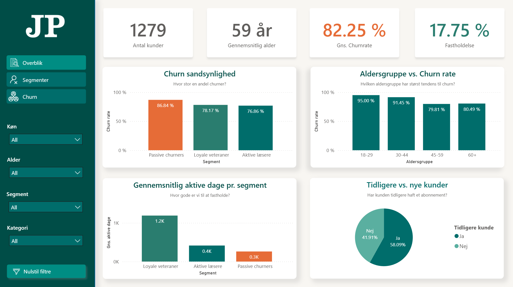{#fig-jp-bi width="75%"}

Contrast handler ifølge Reynolds om at skabe tydelige forskelle mellem elementer, så vigtig information hurtigt aflæses af modtageren (Reynolds, s. 153). I dashboardet anvendes en konsekvent farvekodning for at differentiere segmenterne. Aktive læsere og loyale kunder markeres med forskellige mørkegrønne nuancer, mens passive churners markeres med orange for at visualisere, at dette segment har en forhøjet churn risiko og dermed signalere et behov for handling. I KPI-boksene på tværs af siderne anvendes samme farve princip også til at signalere høj churn rate samt antallet af churners, mens der anvendes en mere positiv grøn farve til at signalere fastholdelse, hvorved modtageren hurtigt kan danne sig et overblik over centrale KPI’er. [@reynolds]

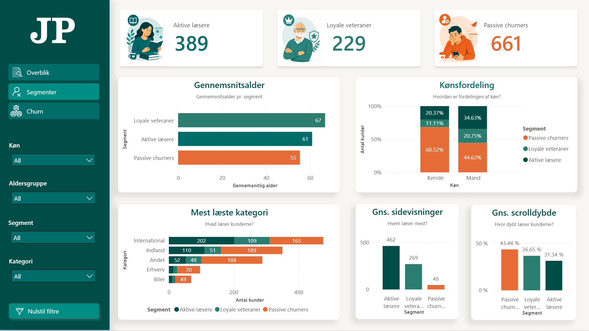{#fig-jp-bi width="75%"}

Repetition beskrives af Reynolds som en fremgangsmåde, hvor genbrug af lignende elementer skaber en visuel sammenhæng på tværs af slides (Reynolds, s. 155). Dette anvendes i dashboardet gennem ensartet farvekodning, genbrug af KPI’er og graf strukturer samt ensrettet tekstformatering, hvilket gør det nemt for modtageren at adskille de forskellige segmenter.
Alignment anvendes for at sikre, at elementerne ikke fremstår tilfældigt placeret. Alle elementer skal være forbundet gennem usynlige linjer, for at skabe en visuel struktur (Reynolds, s. 157). Derfor anvendes et grid-layout i dashboardet, hvor KPI-bokse udgør toppen af slidet og justeres med de underliggende grafer for at skabe en symmetrisk effekt. Dette giver dashboardet et professionelt look, samtidig med at det er overskueligt og læsbart for modtageren. [@reynolds]

Proximity handler om at flytte elementer tættere eller længere fra hinanden for at skabe et visuelt hierarki og en organiseret struktur, hvor nærtliggende elementer grupperes for at skabe sammenhæng. Dette princip anvendes i dashboardets overblik, hvor Churn Sandsynlighed og Aldersgruppe vs. Churn er placeret ved siden af hinanden, så modtageren får et overblik over churn-rate pr. segment og aldersgruppe. Ligeledes er alders- og kønsfordeling placeret ved siden af hinanden under Segmenter, da det giver et demografisk overblik, mens mest læste kategori er placeret i samme visuelle område for at give et indblik i brugernes læseadfærd. På Churn-siden er Feature Importance og churn-sandsynlighed pr. segment placeret tæt, så modtageren får et overblik over, hvilke variable der driver churn.

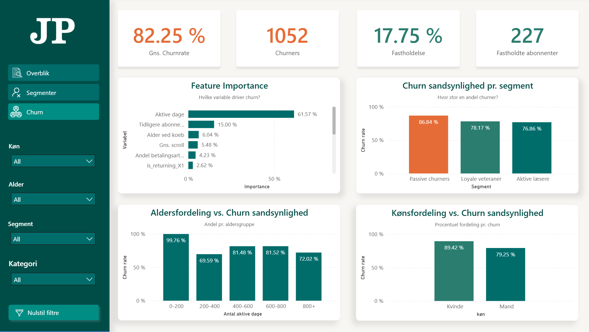{#fig-jp-bi width="75%"}

Dashboardet er designet med udgangspunkt i CRAP-principperne med henblik på at præsentere analysens resultater, som skal fungere som beslutningsstøtte for JP’s kommercielle afdeling i forbindelse med fremtidige kampagner. Ved at anvende de fire designprincipper visualiseres resultaterne på en let og overskuelig måde, hvor analysens væsentligste konklusioner fremhæves. Contrast anvendes til at differentierer segmenterne, hvilket gør det muligt at identificere, hvilke brugere der har en forhøjet churn-risiko. Repetition skaber sammenhæng på tværs af alle slides og gør det genkendeligt for modtageren, mens alignment sikrer et professionelt layout. Proximity anvendes til at gruppere relaterede variable, hvilket styrker forståelsen af brugernes demografi, adfærd og churn-risiko.
Samlet set har principperne medvirket til at udvikle et velfungerende dashboard, som gør det muligt for den kommercielle afdeling at fortolke deres data på en let og overskuelig måde.

\newpage
# Konklusion
På tværs af de afprøvede modeller ses det, at i Random Forest fremstår som den bedste model, idet den opnår den stærkeste samlede performance med en høj sensitivity og evne til at identificere størstedelen af churnere, hvilket er afgørende i en forretningskontekst, hvor oversete churnere udgør et direkte tab. Et simpelt neuralt netværk med class imbalance håndtering kan samtidig også følge med på denne performance med en høj precision, hvilket reducerer antallet af falske positive og dermed unødvendige fastholdelsestiltag. Analysen af de forskellige DL-arkitekturer viser desuden, at øget kompleksitet ikke nødvendigvis forbedrer modellens performance. Tværtimod opnås den bedste balance mellem precision og recall i en relativt simpel model, hvilket både øger robustheden og reducerer risikoen for overfitting. Dette understreger vigtigheden af at tilpasse modelvalg til datasættets størrelse og struktur frem for ukritisk at øge kompleksiteten.

I forhold til prædiktorer for churn viser analysen tydeligt, at adfærdsmæssige variabler er forholdsvist bedre end de demografiske til at predicte churnere. Særligt aktive dage og de forskellige variabler der signalerer engagement med indhold fremstår som de vigtigste faktorer. Dette bekræftes yderligere gennem klyngeanalysen, hvor tre tydelige segmenter identificeres: aktive, loyale og passive brugere. Især den passive klynge, karakteriseret ved lav aktivitet og ingen faste læsevaner, har en betydeligt højere churnrate. Omvendt viser de loyale brugere, at kontinuerlig brug og tilbagevendende abonnementskøb er nogle af de stærkeste indikatorer for fastholdelse. Med dette i mente kan Jyllands-Posten altså, afhængigt af deres forretningsmæssige fokus, enten se bort fra passive brugere til fordel for de tilbagevendende segmenter der er nemmere at fastholde, eller arbejde med dem som den indsats hvor der kan hentes flest nye faste og tilbagevendende brugere, et eksempel på at hente abonnenter, mener vi kunne være at tidligt i abonnementsforløbet guide nye abonnenter til relevant indhold via en onboarding-guide de første 2-4 uger, men hvilken konkret indsats der virker bedst ville kræve tests og supplerende analyser.

Samtidig viser projektet, hvordan disse indsigter kan realisere gennemgående værdi for virksomheden via visualisering. Ved at omsætte dataene og modelresultater til et dashboard bliver det muligt for beslutningstagere at identificere risiko- eller fokusgrupper og handle proaktivt. Dette skaber et konkret og delbart beslutningsgrundlag, som nemt kan forstås af andre afdelinger og bruges til at bestemme hvor ressourcer skal prioriteres for at få den bedst mulige effekt.
Til sidst viser analysen, at brugen af både Machine- og Deep Learning i denne sammenhæng ikke er uden sine juridiske og etiske overvejelser. Behandling af abonnentdata til profilering stiller krav om et klart behandlingsgrundlag, gennemsigtighed og respekt for brugernes rettigheder i henhold til GDPR loven. Desuden rejser brugen af komplekse modeller udfordringer i forhold til transparens og risiko for bias, især hvis historiske mønstre reproduceres ukritisk. Valget af en relativt simpel model bidrager her ikke kun til bedre generalisering, men også til en mere kontrollerbar og ansvarlig anvendelse af data.

Samlet set kan vi konkludere, at Jyllands-Posten med fordel kan anvende Machine Learning til churn-prediktion, når det kombineres med en stærk forståelse af brugeradfærd, en bevidst afvejning mellem modelperformance og fortolkelighed samt en ansvarlig tilgang til dataanvendelse. Dette giver et godt fundament for at udvikle effektive og målrettede fastholdelsesstrategier i et konkurrencepræget digitalt marked.


\newpage
# Literaturliste

::: {#refs}
:::

\newpage
\appendix


# Bilag 1: Kode til dataforberedelse {#sec-bilag1}
```{r}
#| label: Modellering
#| echo: true
#| eval: false
#| 
# *******************************************************************************************
##                                    Oprydning & many-to-many                           ----
# *******************************************************************************************
# Oprydning af subscription for at undgå dobbelt  pseudo_id
# Undgår many-to-many problemet
subscription <- subscription |>  
  group_by(pseudo_id) |> 
  arrange(desc(order_date)) |> 
  slice(1) |> 
  ungroup()

# Oprydning af cancellation for at undgå dobbelt reason
# Undgår many-to-many problemet
cancellation <- cancellation |> 
  group_by(pseudo_id) |> 
  arrange(desc(expiration_date)) |> 
  slice(1) |> 
  ungroup()

master_data <- subscription |> 
  left_join(cancellation, by = c("pseudo_id"))

# *******************************************************************************************
##                                 Behavior features                                     ----
# *******************************************************************************************
# Joiner behavior data og behandler variabler
behavior_features <- behavior |>
  mutate(
    kategori = str_extract(page_url_clean, "(?<=jyllands-posten\\.dk/)([^/]+)")
  ) |>
  group_by(pseudo_id) |> 
  summarise(
    avg_scroll         = mean(scroll_depth),
    page_views         = n(),
    days_with_activity = n_distinct(dt),
    restricted_read    = sum(page_restricted == "yes", na.rm = TRUE),
    dominant_category  = as.factor(
      if (all(is.na(kategori))) NA_character_ 
      else names(which.max(table(na.omit(kategori))))
    ),
    .groups = "drop"
  )

master_data <- master_data |> 
  left_join(behavior_features, by = "pseudo_id")

# Tjekker om duplikater. 
master_data |> 
  group_by(pseudo_id) |> 
  filter(n() > 1)

# *******************************************************************************************
#                                        Nye variabler                                   ----
# *******************************************************************************************
# Konverterer datoer og laver nye variable
master_data <- master_data |> 
  mutate(
    birthdate                = as.Date(birthdate, format = "%d-%m-%Y"),
    subscription_cancel_date = as.Date(subscription_cancel_date, format = "%d-%m-%Y"),
    usr_created              = as.Date(usr_created, format = "%d-%m-%Y"),
    first_campaign_day       = as.Date(first_campaign_day, format = "%d-%m-%Y"),
    last_campaign_day        = as.Date(last_campaign_day, format = "%d-%m-%Y"),
    order_date               = as.Date(order_date),
    expiration_date          = as.Date(expiration_date),
    # Demografi
    age_at_order             = as.numeric((order_date - birthdate) / 365),
    days_since_registration  = as.numeric(order_date - usr_created),
    gender                   = as.factor(koen),
    # Har kunden tidligere deltaget i kampagner
    is_returning = as.factor(if_else(previous_subscriptions >= 1, 1, 0)),
    # Læst indhold
    pages_on_restricted      = restricted_read / page_views,
    # Vækst i nyhedsbreve
    newsletter_growth        = newsletters_after_order - newsletters_before_order,
    # Udvikling af nyhedsbreve
    permission_upgraded      = if_else(permission_given_order == "false" & permission_given_today == "true", 1, 0),
    permission_withdrawn     = if_else(permission_given_order == "true" & permission_given_today == "false", 1, 0) 
  )

# *******************************************************************************************
#                                        Target Variablet                                ----
# *******************************************************************************************
# Beregner churn baseret på expiration_date
master_data <- master_data |> 
  mutate(
    # Churner brugeren efter kampagnen
    churned = ifelse(is.na(expiration_date), 0, 1),
    # Churner bruger kort tid efter kampagne udløb
    churn_flag = case_when(
      subscription_cancel_date - last_campaign_day <= 30 ~ "early_churn",
      TRUE ~ "no_early_churn"
    )
  )

table(master_data$churned)

# Skaber overblik og årsagerne til at de churner
årsag_overblik <- master_data |> 
  filter(churned == "1") |> 
  count(reason, sort = TRUE)

print(årsag_overblik)

# *******************************************************************************************
#                                        Feature selection                               ----
# *******************************************************************************************
# Vi vælger variabler til ML modellering
model_data <- master_data |> 
  select(
    churned, age_at_order, gender, is_returning, account_active_days, permission_given_order,
    permission_given_today, previous_subscriptions, previous_campaigns, avg_scroll,
    page_views, days_with_activity, newsletter_growth, dominant_category, permission_upgraded,
    permission_withdrawn, pages_on_restricted
  )

gender_probs <- prop.table(table(model_data$gender[model_data$gender != ""]))

n_unknown <- sum(model_data$gender == "")

model_data <- model_data |> 
  mutate(
    gender = case_when(
    gender == "" ~ sample(names(gender_probs), size = n(), replace = TRUE, prob = gender_probs),
    TRUE ~ gender),
    gender = case_when(
      gender == "Mand" ~ 0, # Mand bliver til 0
      gender == "Kvinde" ~ 1 # Kvinde bliver til 1
    ),
    age_at_order = if_else(is.na(age_at_order), median(age_at_order, na.rm = TRUE), age_at_order),
    avg_scroll = if_else(is.na(avg_scroll), median(avg_scroll, na.rm = TRUE), avg_scroll),
    page_views = if_else(is.na(page_views), median(page_views, na.rm = TRUE), page_views),
    days_with_activity = if_else(is.na(days_with_activity), median(days_with_activity, na.rm = TRUE), days_with_activity),
    dominant_category = if_else(is.na(dominant_category), "other", dominant_category),
    pages_on_restricted = if_else(is.na(pages_on_restricted), median(pages_on_restricted, na.rm = TRUE), pages_on_restricted),
    dominant_category = fct_lump_prop(dominant_category, prop = 0.05, other_level = "other")
  )

# Konvetere characther til factor
model_data <- model_data |> 
  mutate(across(where(is.character), as.factor)) |> 
  mutate(
    churned = factor(churned),
    gender = factor(gender),
    permission_upgraded = factor(permission_upgraded),
    permission_withdrawn = factor(permission_withdrawn)
  )

# Reorder variablerne sådan at arbejdet i python bliver lidt nemmere
  model_data <- model_data |> 
  select(
    # Target
    churned,
    # Faktorer med 2 levels
    gender, is_returning, -permission_given_order, -permission_given_today, 
    permission_upgraded, permission_withdrawn,
    # Faktorer med mere end 2 levels
    dominant_category,
    # Numeriske
    age_at_order, account_active_days, previous_subscriptions, previous_campaigns,
    avg_scroll, page_views, days_with_activity, newsletter_growth, pages_on_restricted
  )

write_csv(model_data, "model_data.csv")
```

\newpage
# Bilag 2: Rangering af recipe{#sec-bilag2}

## Downsampling rangering

{#fig-model-rangering width="80%"}

## Upsampling rangering:

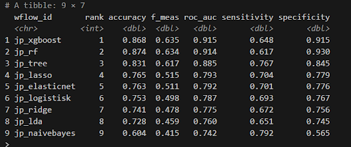{#fig-model-rangering width="80%"}

## No sampling rangering:

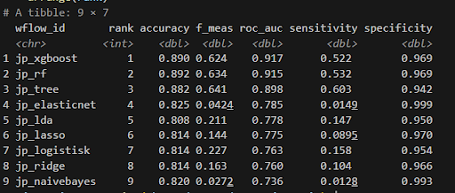{#fig-model-rangering width="80%"}


